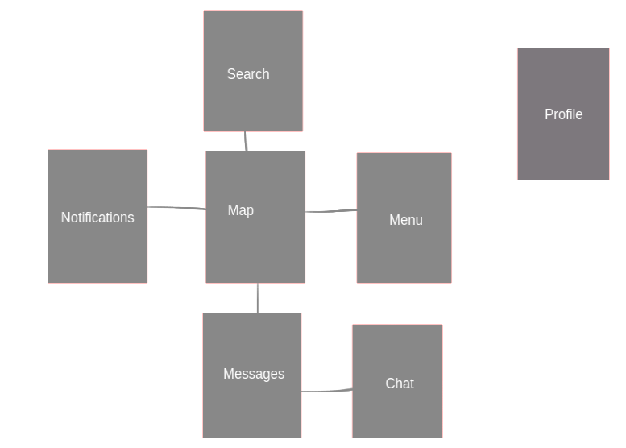
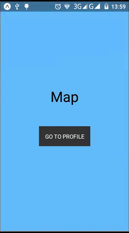
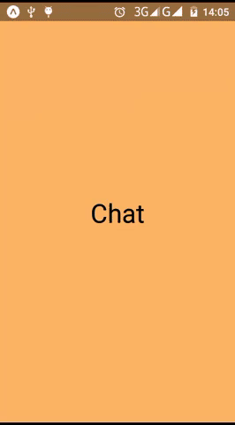

# React native swipe navigation

*Swipe to navigate*

It's another react native navigation library -- still in beta version --


## Snapchat demo


## Installation


```bash
yarn add react-native-swipe-navigation
```

or

```bash
npm install --save react-native-swipe-navigation
```

## Usage

If we want to implement this navigation style





So this library provides for us a clean and an easy way to do it

```javascript
import SwipeNavigator from 'react-native-swipe-navigation';

const Navigator = SwipeNavigator({
  Map: {
    screen: Map,
    left: 'Notifications',
    right: 'Menu',
    top: 'Search',
    bottom: 'Messages',
  },

  Notifications: {
    screen: Notifications,
    type: 'push', // push is the default type
  },

  Menu: {
    screen: Menu,
    type: 'over',
  },

  Search: {
    screen: Search,
    type: 'place',
  },

  Messages: {
    screen: Messages,
    right: 'Chat',
  },

  Chat: {
    screen: Chat,
    type: 'over',
  },

  Profile: {
    screen: Profile,
    left: '@BACK',
    type: 'over',
  },
});

export default Navigator

```

Now the SwipeNavigator will pass a nav props to all screens for more control

```javascript
  class Map extends React.Component {
    componentDidMount() {
      const { nav } = this.props;

      // Here we can control the navigation using these listeners

      /***
        if a navigation detected so the navigator will ask for a permission just for the active screen
      */
      nav.onNavigateShouldAllow(() => {
        return true;
      });

      nav.onNavigateLeftShouldAllow(() => {
        return true;
      });

      nav.onNavigateRightShouldAllow(() => {
        return true;
      });

      nav.onNavigateUpShouldAllow(() => {
        return true;
      });

      nav.onNavigateDownShouldAllow(() => {
        return true;
      });

      /**
        if we are navigating from screen A to screen B
        so the navigator will fire onNavigateStarted
        and onNavigateCompleted listeners for both A and B
      */

      nav.onNavigateLeftStartedListener(({isBack, isMain}) => {
        // Do anything you want to do here
        /**
          isMain -> Boolean - define if this screen is the active one
          isBack -> Boolean - define if we are navigating back
        */
      });

      nav.onNavigateLeftCompletedListener(({completed, isBack}) => {
        // completed -> Boolean - define if the navigation realized
      });

      nav.onNavigateRightStartedListener(({isBack, isMain}) => {

      });

      nav.onNavigateRightCompletedListener(({completed, isBack}) => {

      });

      nav.onNavigateDownStartedListener(({isBack, isMain}) => {

      });

      nav.onNavigateDownCompletedListener(({completed, isBack}) => {

      });

      nav.onNavigateUpStartedListener(({isBack, isMain}) => {

      });

      nav.onNavigateUpCompletedListener(({completed, isBack}) => {

      });

      /**
        Also you can navigate using these methods:

        * nav.navigateLeft()

        * nav.navigateRight()

        * nav.navigateDown()

        * nav.navigateUp()

        * nav.navigateBack()

        * nav.navigate(screen, config)

            screen: String or React.Component

            config: {
              leaveFrom: 'left' | 'right' | 'top' | 'bottom'
              type: 'over' | 'push' | 'place'
              color: 'it should be in hex format'
           }

      */

    }

    componentWillUnmount() {
      // clean all listeners of this screen
      this.props.nav.cleanUp()
    }

    render() {
      return (
        <View style={{flex: 1, backgroundColor: 'blue'}}>
          <TouchableOpacity onPress={() => this.props.nav.navigate('Profile')}>
            <Text>GO TO PROFILE</Text>
          </TouchableOpacity>
        </View>
      );
    }
  }
```  
